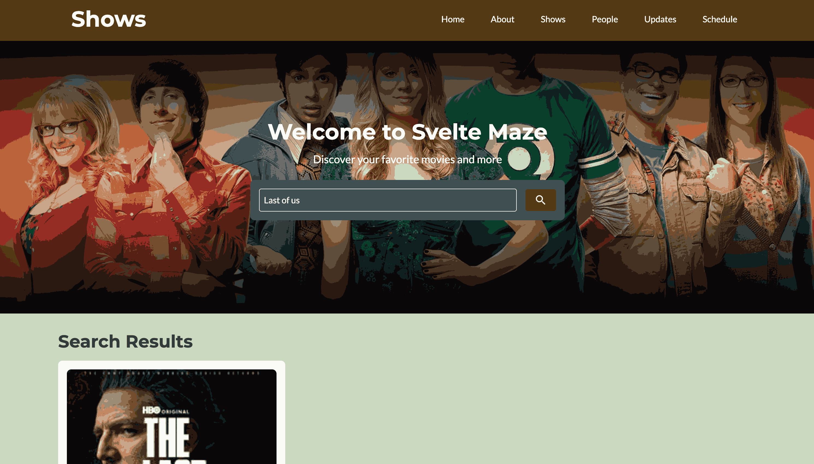

# Svelte Kite Movies


## About the Project

Svelte Kit Movies is a web application built with SvelteKit, TailwindCSS, and TypeScript. It allows users to search for movies and view detailed information about them. The project leverages modern web technologies to provide a fast, responsive, and user-friendly experience.

For movies data it uses the following API which is also created by me https://softgenie.org/api/movies

## Screenshots

Please find some of the screenshots of the application below.




## SSR - When to render on client and when on server?

server-side rendering (SSR), consider the following:

- **Render on the server** when the data is dynamic, sensitive, or needs to be indexed by search engines. For example, fetching movie details from an API that requires authentication or ensuring SEO for movie pages.
- **Render on the client** when the data is user-specific, frequently updated, or doesn't need to be indexed. For example, displaying a user's watchlist or handling client-side interactions like filtering and sorting movies.

Here, on the movie details page, the whole content is being loaded on server and meta tags are being populated through the dynamic data.

By balancing SSR and client-side rendering, you can optimize performance and user experience.
### Features
- Search for movies by title.
- View detailed information about movies, including release date, rating, and synopsis.
- Responsive design for seamless use on desktop and mobile devices.

### Technologies Used
- **SvelteKit**: A modern framework for building fast and scalable web applications.
- **TailwindCSS**: A utility-first CSS framework for styling.
- **TypeScript**: A strongly typed programming language for better code quality and maintainability.

### Getting Started
To run the project locally, follow these steps:
1. Clone the repository:
    ```bash
    git clone https://github.com/apfirebolt/svelte-kit-movies.git
    ```
2. Navigate to the project directory:
    ```bash
    cd svelte-kit-movies
    ```
3. Install dependencies:
    ```bash
    npm install
    ```
4. Start the development server:
    ```bash
    npm run dev
    ```
5. Open your browser and navigate to `http://localhost:8080`.

### Contributing
Contributions are welcome! Feel free to open an issue or submit a pull request.

### License
This project is licensed under the MIT License. See the `LICENSE` file for details.