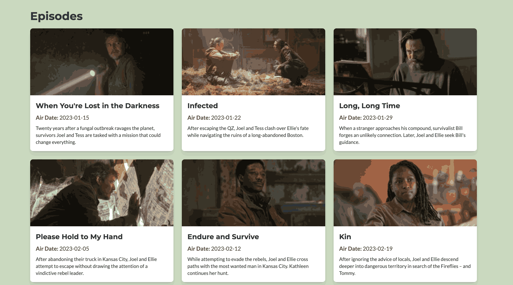

# Svelte Kite TV Maze


## About the Project

This application is a TV show information platform powered by the TV Maze API. It allows users to search for TV shows, view detailed information about them, and explore various features such as cast details, episode guides, and ratings. The application is designed to provide a seamless and responsive user experience, making it easy to discover and learn more about your favorite TV shows.

Key highlights of the application include:

- **Search Functionality**: Quickly find TV shows by entering their titles.
- **Detailed Show Information**: Access comprehensive details about each show, including its synopsis, genres, runtime, and network.
- **Cast and Crew**: View information about the cast and crew involved in the show.
- **Episode Guide**: Explore a list of episodes for each season, complete with air dates and summaries.
- **Responsive Design**: Optimized for both desktop and mobile devices, ensuring a smooth experience across all screen sizes.

By leveraging the TV Maze API, this application provides up-to-date and accurate information about a wide range of TV shows, making it a valuable resource for TV enthusiasts. Whether you're looking for your next binge-worthy series or just want to learn more about a show, this app has you covered.

It shows schedule for different countries on a given day so you don't miss you favorite shows.

## Screenshots

Please find some of the screenshots of the application below.





## SSR - When to render on client and when on server?

server-side rendering (SSR), consider the following:

- **Render on the server** when the data is dynamic, sensitive, or needs to be indexed by search engines. For example, fetching movie details from an API that requires authentication or ensuring SEO for movie pages.
- **Render on the client** when the data is user-specific, frequently updated, or doesn't need to be indexed. For example, displaying a user's watchlist or handling client-side interactions like filtering and sorting movies.

By balancing SSR and client-side rendering, you can optimize performance and user experience.
### Features
- Search for movies by title.
- View detailed information about movies, including release date, rating, and synopsis.
- Responsive design for seamless use on desktop and mobile devices.

### Technologies Used
- **SvelteKit**: A modern framework for building fast and scalable web applications.
- **TailwindCSS**: A utility-first CSS framework for styling.
- **TypeScript**: A strongly typed programming language for better code quality and maintainability.

### Getting Started
To run the project locally, follow these steps:
1. Clone the repository:
    ```bash
    git clone https://github.com/apfirebolt/sveltekit-tv-maze.git
    ```
2. Navigate to the project directory:
    ```bash
    cd sveltekit-tv-maze
    ```
3. Install dependencies:
    ```bash
    npm install
    ```
4. Start the development server:
    ```bash
    npm run dev
    ```
5. Open your browser and navigate to `http://localhost:8080`.

### Contributing
Contributions are welcome! Feel free to open an issue or submit a pull request.

### License
This project is licensed under the MIT License. See the `LICENSE` file for details.